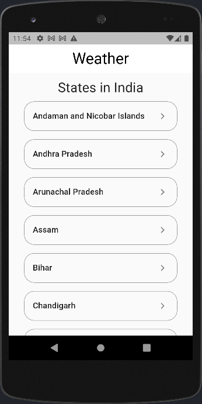
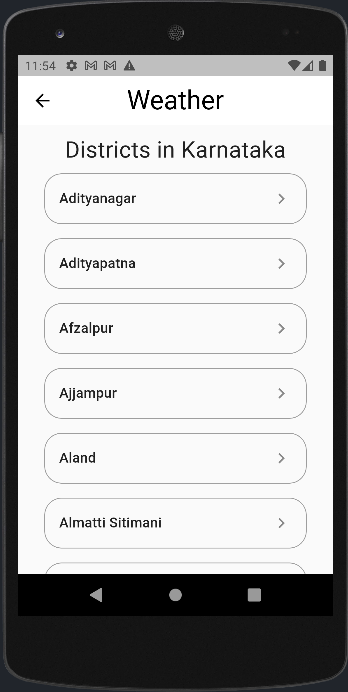
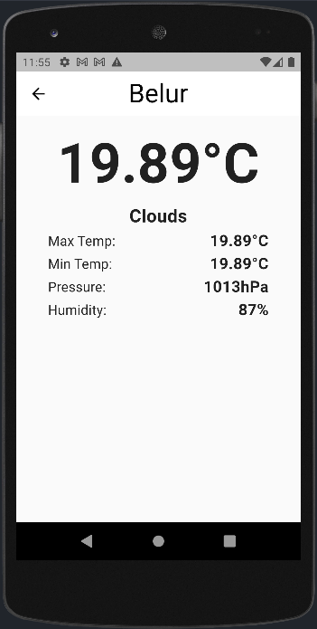

# Weather App

A flutter application that allows the user to view the weather details of a selected location (in India)

## Features

- Dynamically retrieve data using API calls
- Null Safe
- Light weight app


## API Reference

#### Get states in India

```http
  GET https://www.universal-tutorial.com/api/states/India

  headers = {
      "Authorization":
          "Bearer $tokenId",
      "Accept": "application/json"
    }
```

| Parameter | Type     | Description                |
| :-------- | :------- | :------------------------- |
| `tokenId` | `string` | **Required**. Token generated for a user |


#### Get cities in a state

```http
  GET https://www.universal-tutorial.com/api/cities/$stateName

  headers = {
      "Authorization":
          "Bearer $tokenId",
      "Accept": "application/json"
    }
```

| Parameter | Type     | Description                |
| :-------- | :------- | :------------------------- |
| `tokenId` | `string` | **Required**. Token generated for a user |
| `stateName` | `string` | **Required**. Name of state |

#### Get weather information

```http
  GET https://api.openweathermap.org/data/2.5/weather?q=$city&appid=${apiKey}&units=metric
```

| Parameter | Type     | Description                       |
| :-------- | :------- | :-------------------------------- |
| `apiKey`      | `string` | **Required**. API key generated by OpenWeatherMap |
| `city` | `string` | **Required**. Name of city |


## Screenshots


